# Arquitetura do Sistema — Catálogo Tom Hanks (HANKS+)

Documento que descreve a arquitetura **atual** do projeto, com base no código-fonte
(`frontend/`, `backend/`, `auth-service/`, `docker-compose*.yml`, `Dockerfile`).

## 1. Visão geral

O sistema é uma aplicação web para navegar pelo catálogo de filmes de Tom Hanks
(dados do TMDB), com favoritos, comentários e controle de acesso por papéis (RBAC).
Está dividido em **dois containers** (microsserviços) que compartilham o mesmo banco
MariaDB/MySQL e a mesma `SECRET_KEY` de JWT:

| Componente | Tecnologia | Responsabilidade |
|---|---|---|
| **catalogo** | FastAPI (Python 3.12) + SPA Angular 21 servida como estáticos | Único ponto de entrada público (porta 8000). Filmes (TMDB), favoritos, comentários e *bridge* para autenticação |
| **auth-service** | FastAPI (Python 3.12) | Cadastro, login (JWT), RBAC, usuários, recuperação de senha. Só acessível pela rede interna Docker (`expose 8001`) |
| **Banco de dados** | MariaDB / MySQL externo | Tabelas de ambos os serviços |
| **TMDB API** | Externa | Fonte dos filmes |
| **Mailtrap** | SMTP sandbox externo | Envio do e-mail de redefinição de senha |

## 2. Diagrama de contexto e implantação

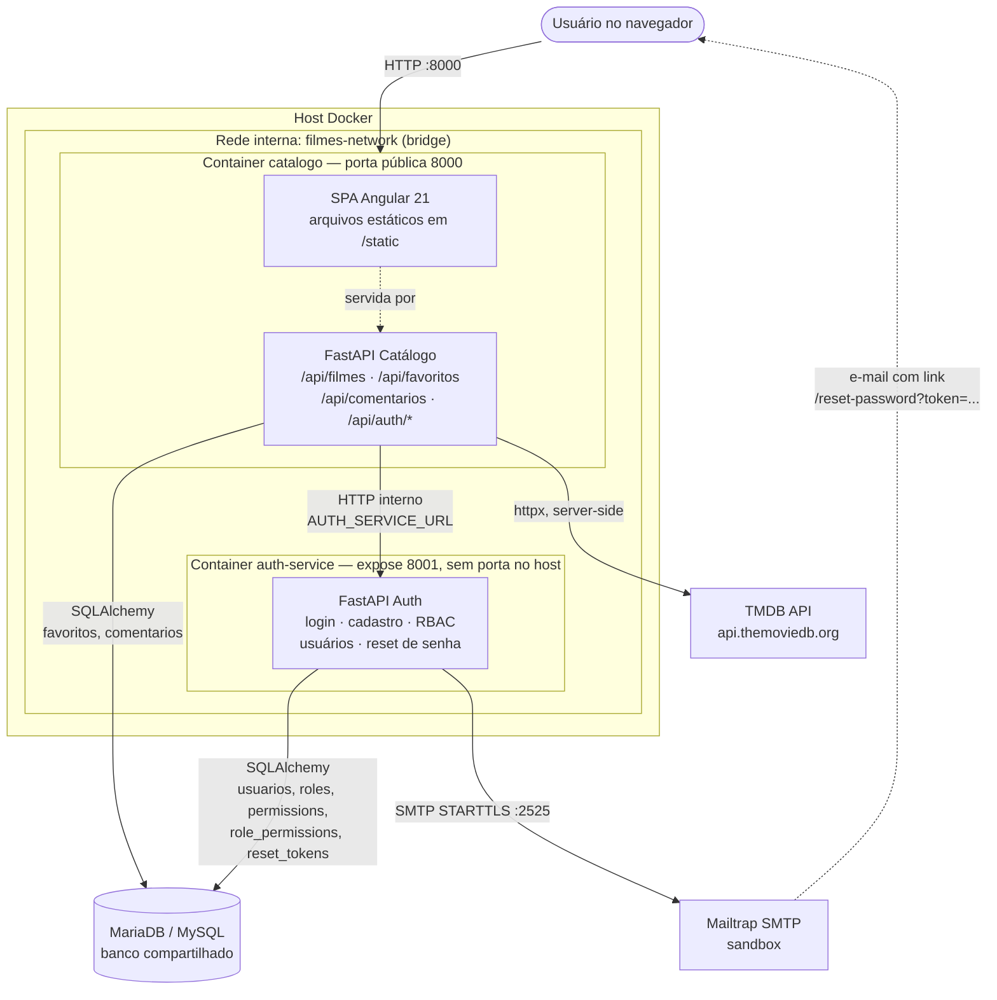

Pontos-chave:

- O navegador **nunca** fala com o `auth-service` nem com o TMDB diretamente; tudo passa pelo catálogo.
- O link de redefinição enviado por e-mail aponta para o catálogo (`CATALOGO_URL/reset-password?token=...`), mantendo o `auth-service` isolado.
- Os dois serviços usam a mesma `DATABASE_URL`, `SECRET_KEY` e `ALGORITHM`.

## 3. Build e empacotamento

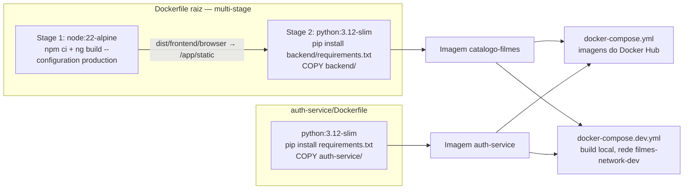

Em desenvolvimento sem Docker, o Angular usa `frontend/proxy.conf.json` para
encaminhar `/api` para `http://127.0.0.1:8000`.

## 4. Frontend (Angular 21, standalone + signals)

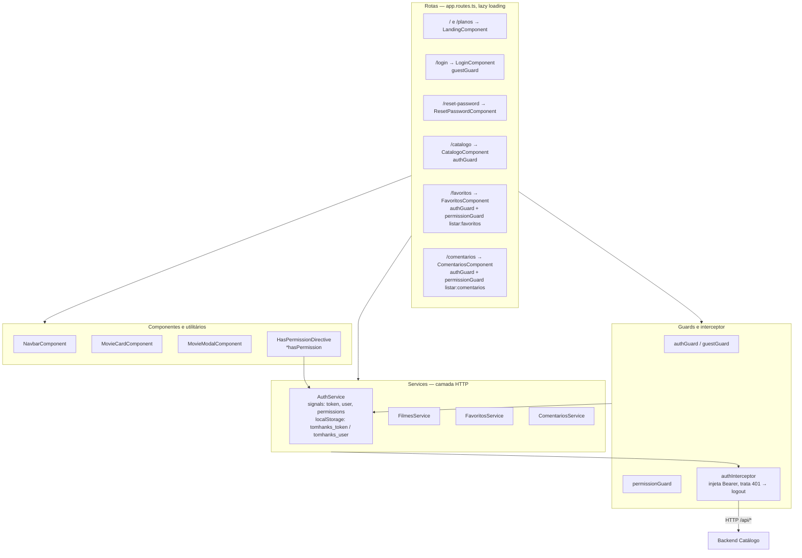

`AuthService.hasPermission()` considera `administrar:sistema` como coringa, espelhando a regra do backend.

## 5. Backend Catálogo — camadas

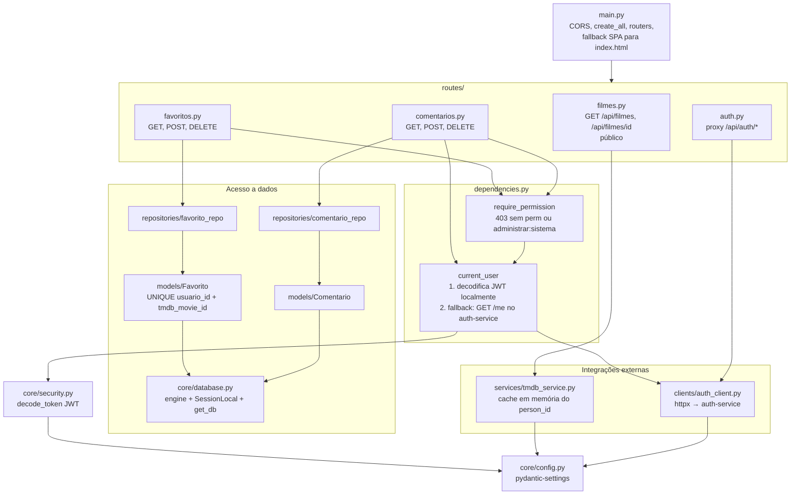

### Endpoints e permissões exigidas

| Método | Rota | Permissão |
|---|---|---|
| GET | `/api/filmes`, `/api/filmes/{id}` | pública |
| GET | `/api/favoritos` | `listar:favoritos` |
| POST | `/api/favoritos` | `adicionar:favoritos` |
| DELETE | `/api/favoritos/{tmdb_movie_id}` | `remover:favoritos` |
| GET | `/api/comentarios`, `/api/comentarios/{tmdb_movie_id}` | `listar:comentarios` |
| POST | `/api/comentarios` | `criar:comentarios` |
| DELETE | `/api/comentarios/{id}` | autor com `apagar:comentario-proprio`, ou `apagar:comentario-de-outro` / `administrar:sistema` / papel `admin` |
| `*` | `/api/auth/*` | repassado ao auth-service (que aplica suas próprias permissões) |

## 6. Auth-service — camadas

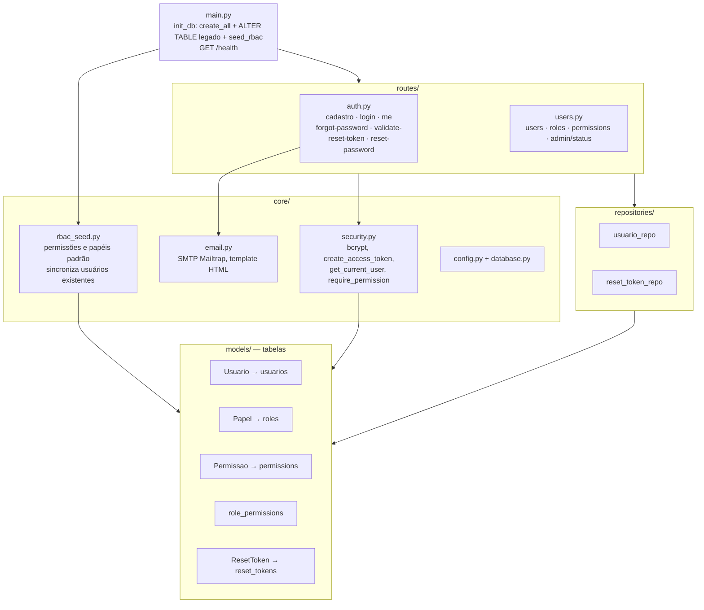

## 7. Modelo de dados (tabelas compartilhadas no mesmo banco)

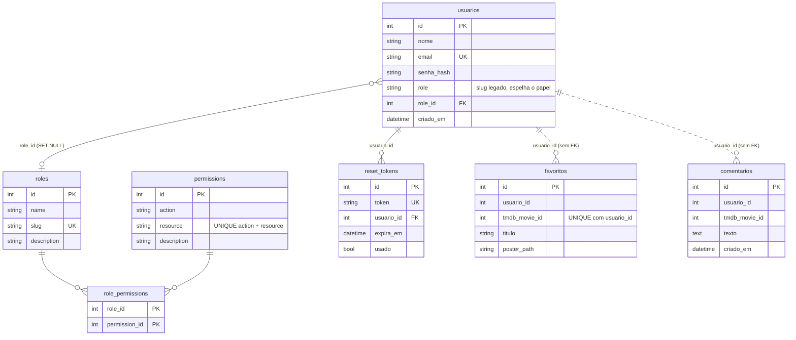

As tabelas `favoritos` e `comentarios` pertencem ao **catálogo**; as demais, ao **auth-service**.
A ligação entre os dois domínios é apenas lógica (`usuario_id` sem chave estrangeira).

## 8. RBAC — papéis e permissões

Permissões seguem o formato `acao:recurso`. `administrar:sistema` funciona como coringa
no frontend, no catálogo e no auth-service.

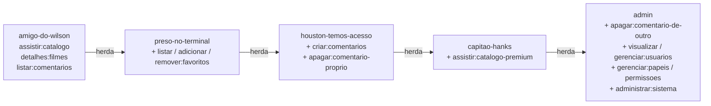

O cadastro público aceita apenas os quatro primeiros papéis; pedir `admin` retorna HTTP 403.
Detalhes em [`PERFIS.md`](PERFIS.md).

## 9. Fluxos principais

### 9.1 Login e uso de rota protegida

O JWT é assinado pelo auth-service e contém `sub`, `email`, `nome`, `role` e `permissions`.
Como o catálogo compartilha a `SECRET_KEY`, ele valida o token **localmente**, sem chamada de rede.

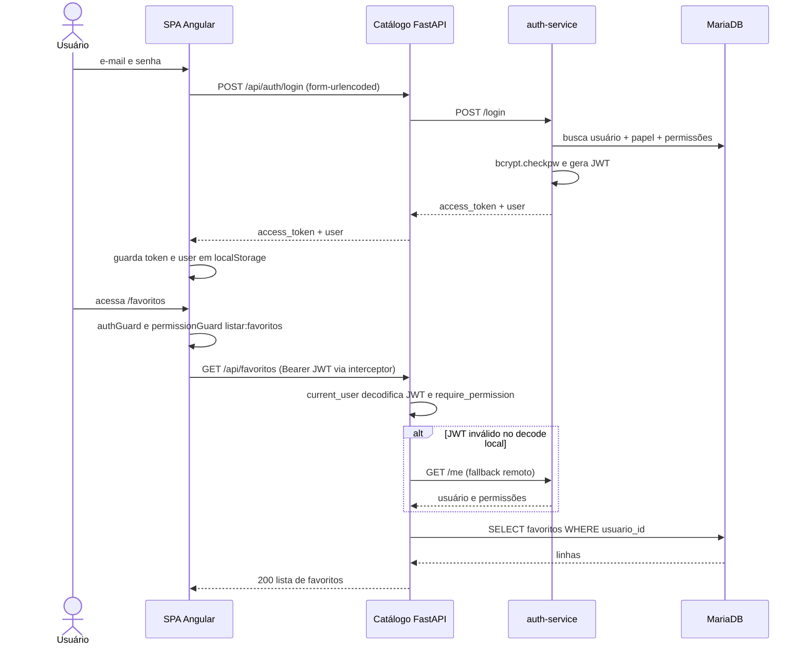

### 9.2 Consulta de filmes

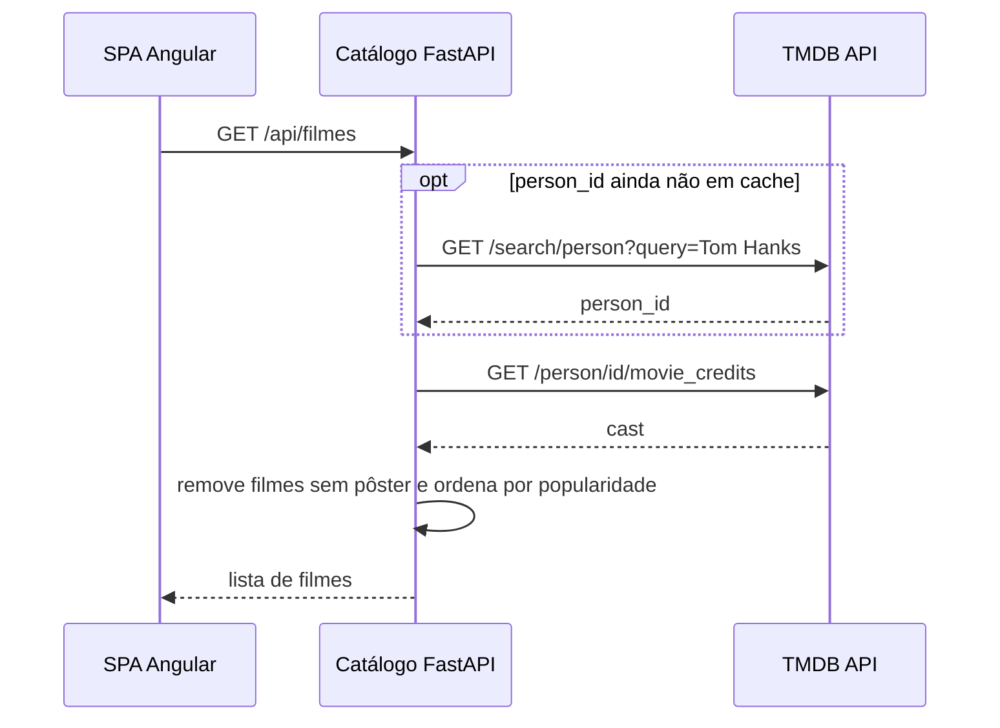

### 9.3 Recuperação de senha

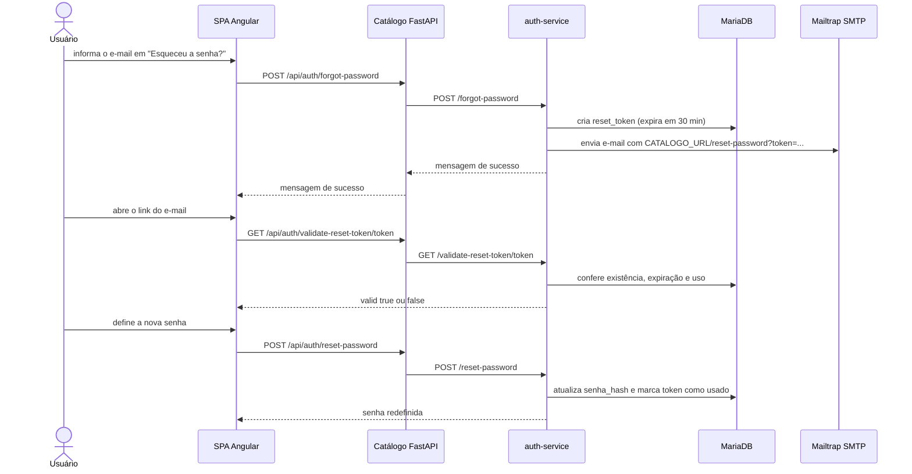

### 9.4 Remoção de comentário com moderação

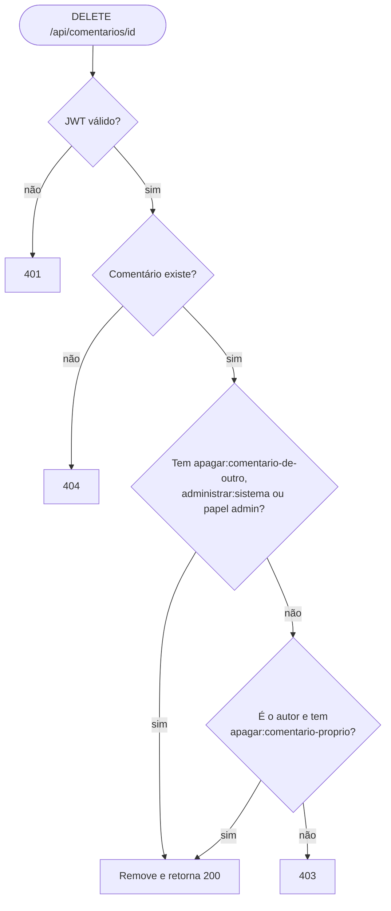

## 10. Configuração por variáveis de ambiente

| Variável | Usada por | Função |
|---|---|---|
| `DATABASE_URL` | catálogo, auth | Conexão SQLAlchemy (`mysql+pymysql://...`) |
| `SECRET_KEY`, `ALGORITHM`, `ACCESS_TOKEN_EXPIRE_MINUTES` | catálogo, auth | Assinatura e validação do JWT (chave compartilhada) |
| `TMDB_API_KEY`, `TMDB_BASE_URL` | catálogo | Acesso ao TMDB (v3 `api_key` ou token v4 Bearer) |
| `AUTH_SERVICE_URL` | catálogo | URL interna do auth-service (`http://auth-service:8001`) |
| `MAILTRAP_*`, `RESET_TOKEN_EXPIRE_MINUTES`, `RESET_REQUEST_*`, `EMAIL_LOG_LINK_WITHOUT_SMTP` | auth | SMTP, validade do token de reset, limite de solicitações e modo dev sem SMTP |
| `CATALOGO_URL` | auth | Base pública usada no link do e-mail |
| `PORT` | ambos | Porta do uvicorn (8000 e 8001) |

## 11. Testes

`tests/` usa `pytest` com SQLite em memória e `TestClient` do FastAPI:

- `test_auth_service.py`: health, cadastro/login, matriz de papéis, bloqueio de `admin` no cadastro, fluxo de reset de senha (incluindo token reutilizado, expirado e inexistente).
- `test_backend_proxy.py`: estrutura do app do catálogo, RBAC de favoritos/comentários e moderação de comentários.

## 12. Observações sobre o estado atual

Pontos observados no código que vale ter em mente ao evoluir a arquitetura:

- **Banco compartilhado:** os dois serviços gravam no mesmo schema, então o desacoplamento é de processo, não de dados.
- **JWT com permissões embutidas:** mudar o papel de um usuário só vale para o catálogo após o token expirar (padrão 1440 min) ou novo login, pois o catálogo confia nas permissões do token.
- **`POST /forgot-password`** responde sempre com mensagem neutra (sem `token` e sem revelar se o e-mail existe), limita solicitações por usuário (`RESET_REQUEST_LIMIT` por `RESET_REQUEST_WINDOW_MINUTES`) e registra falhas de envio em log. Sem credenciais SMTP o envio falha, salvo com `EMAIL_LOG_LINK_WITHOUT_SMTP=true` (dev).
- **`GET /api/auth/users/{id}/role`** e `GET /api/auth/roles` não exigem autenticação no auth-service.
- **CORS** está com `allow_origins=["*"]` nos dois serviços.
- **`docker-compose.yml`** usa imagens publicadas (`schinor/...`) e **`docker-compose.dev.yml`** faz build local.
- O auth-service tem migrações Alembic (`migrations/versions/001`, `002`), mas `init_db()` também roda `create_all` e `ALTER TABLE` automáticos na inicialização.
